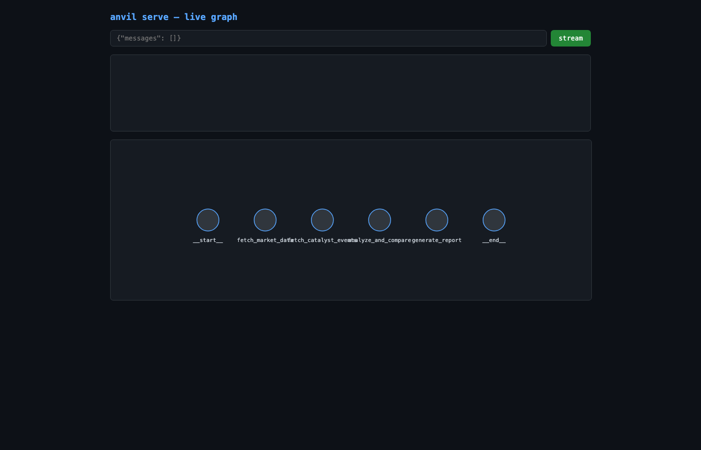

# Example: equity-research-agent

End-to-end Anvil example with **all 4 phases** forged from one sentence — exercises the full per-project pipeline (PLAN.md loading + multi-node graph assembly), not just the smoke test.

Brief passed to `anvil init`:

> Research Google's stock price action over the last 7 trading days, surface notable peer stock movements, and list any upcoming earnings or market events around it.

ProjectScribe named the slug `equity-research-agent`; PlanScribe broke the brief into 4 phases; `anvil run --all` then forged each phase in order via NodeForge → EvalSmith ∥ DocScribe → MergeBot, accumulating state across phases; GraphScribe assembled the linear chain at the end.

## How it was produced

```bash
# 1. Scaffold the project (ProjectScribe -> ConventionsScribe -> PlanScribe)
anvil init "Research Google's stock price action over the last 7 trading days, \
            surface notable peer stock movements, and list any upcoming earnings \
            or market events around it" \
           --out examples
cd examples/equity-research-agent

# 2. Forge every phase listed in PLAN.md (4 phases)
anvil run --all

# 3. Serve as an API with live graph view
anvil serve --web --port 8766
```

## Forged topology

`START → fetch_market_data → fetch_catalyst_events → analyze_and_compare → generate_report → END`

Each node is real, contextually-correct generated code:

| Phase | Node | Real third-party libs the generated code uses |
|-------|------|------------------------------------------------|
| 1 | `fetch_market_data` | `yfinance`, `tenacity` |
| 2 | `fetch_catalyst_events` | `httpx`, `tenacity` |
| 3 | `analyze_and_compare` | `pandas`, `statistics` |
| 4 | `generate_report` | `pydantic`, `tenacity` |

## Live graph view



LangGraph's introspection sees all four nodes plus `__start__`/`__end__`, rendered live from `/graph.json`.

## What's in this folder

| Path | Producer | Description |
|------|----------|-------------|
| `pdd/context/project.md` | ProjectScribe | "What we're building", personas, stack, constraints |
| `pdd/context/conventions.md` + `decisions.md` | ConventionsScribe | Style guide + decisions log |
| `pdd/prompts/features/equity-research/PLAN-equity-research.md` | PlanScribe | 4-phase implementation plan |
| `pdd/prompts/features/equity-research/equity-research-01-fetch-market-data.md` | PlanScribe | Phase 1 prompt (full Intent/Inputs/Outputs/Acceptance) |
| `pdd/prompts/features/equity-research/equity-research-{02,03,04}-*.md` | phase_loader fallback | Synthesized phase prompts (PlanScribe only emits phase-01 today) |
| `src/nodes/<node>.py` × 4 | NodeForge | One generated LangGraph node per phase |
| `graph.py` | GraphScribe | Top-level graph: linear chain wiring all 4 nodes |
| `evals/test_<node>.py` × 4 | EvalSmith | pytest + LLM-as-judge runner per node |
| `evals/golden/<node>.jsonl` × 4 | EvalSmith | 7-case golden datasets |
| `docs/adr/0{01..04}-*.md` | DocScribe | Per-phase ADRs in Michael Nygard format |
| `pull-requests/phase-{01..04}-pr.md` | MergeBot | Per-phase PR titles, bodies, labels, reviewer checklists |
| `screenshots/serve-web.png` | `anvil serve --web` | Live graph rendering |

## Honest notes on the current scaffold

- **`--all` works because of a fallback**: PlanScribe only emits the phase-01 prompt file. The phase loader auto-synthesizes phase-02..N prompts from PLAN.md's `**Produces:**` text so `anvil run --all` can execute. Generated synthetic prompts are marked with an `_auto-synthesized_` footer — edit freely. A proper fix would be extending PlanScribe's response schema to return all N prompts up-front.
- **State is accumulated, not designed**: between phases, the runner concatenates each node's `new_state_fields` declarations into the next phase's `state_schema_source`. NodeForge for phase 2+ sees what phase 1 wrote and adds to it. No schema-level validation across phases.
- **Topology is linear**: GraphScribe assembles a hard-coded `START → n1 → ... → nN → END` chain in PLAN order, ignoring conditional edges or fan-out/fan-in. Adequate for sequential pipelines, insufficient for true agents with branching. Fixing this would mean (a) PLAN.md carrying explicit edge information, and (b) GraphScribe consuming it.
- **No PR submission**: `pull-requests/phase-NN-pr.md` files are drafted by MergeBot but not opened via `gh`. `anvil plan` has `gh issue create` wired; `anvil run` doesn't yet wire `gh pr create`.

## Reproducing the run

The `.venv` in the anvil repo needs `yfinance`, `pydantic`, `beautifulsoup4`, `httpx`, `tenacity`, and `pandas` for the generated nodes to import at serve time. A future improvement would have `anvil run` collect each NodeForge output's `external_deps` into a `requirements.txt` at the project root.
