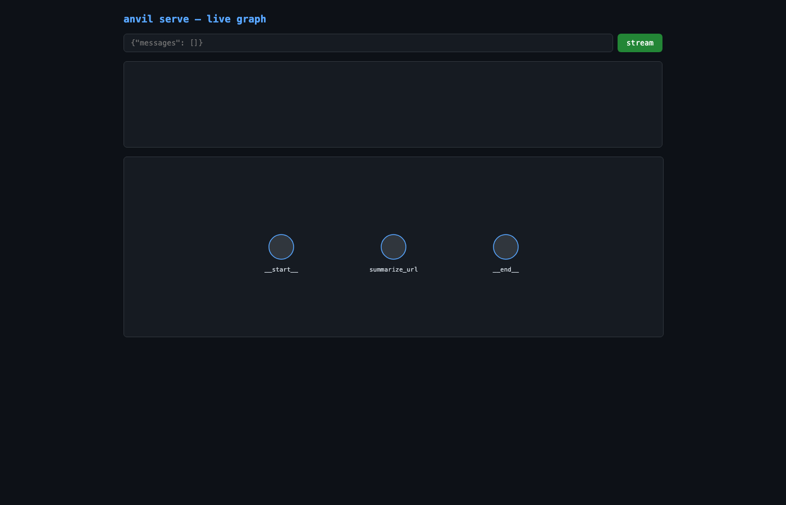

# Example: research-claims-distiller

A worked example of the full **`anvil init` → `anvil run` → `anvil serve --web`** loop, produced end-to-end by the Anvil CLI against this one-sentence brief:

> Build a research summarizer: take a URL list, fetch each page, extract key claims, and emit a one-page brief with citations.

The directory name, project brief, conventions, plan, node code, evals, ADR, PR body, and `graph.py` were all generated by Gemini Flash sub-agents — no hand-edited code.

## How it was produced

```bash
# 1. Scaffold (ProjectScribe → ConventionsScribe → PlanScribe)
anvil init "Build a research summarizer: take a URL list, fetch each page, \
            extract key claims, and emit a one-page brief with citations" \
           --out examples
# → examples/research-claims-distiller/ (slug picked by ProjectScribe)

cd examples/research-claims-distiller

# 2. Forge phase 1 (NodeForge → EvalSmith ∥ DocScribe → MergeBot → GraphScribe)
anvil run --phase 1
# → test-output/{src/nodes,evals,docs/adr,pr.md} + src/nodes/<node>.py + graph.py

# 3. Serve as an API with live graph view
anvil serve --web --port 8765
# → http://127.0.0.1:8765/
```

## What's in this folder

| Path | Producer | What it is |
|------|----------|------------|
| `pdd/context/project.md` | ProjectScribe | "What we're building", personas, stack, constraints |
| `pdd/context/conventions.md` | ConventionsScribe | Style + anti-patterns |
| `pdd/context/decisions.md` | ConventionsScribe | Architectural decisions log |
| `pdd/prompts/features/claims-distiller/PLAN-claims-distiller.md` | PlanScribe | Phased implementation plan |
| `pdd/prompts/features/claims-distiller/claims-distiller-01-fetch-sources.md` | PlanScribe | Phase-01 prompt artifact |
| `src/nodes/summarize_url_node.py` | NodeForge | The generated LangGraph node |
| `graph.py` | GraphScribe | Top-level graph assembly — what `anvil serve` loads |
| `test-output/evals/test_summarize_url.py` | EvalSmith | pytest + LLM-as-judge runner |
| `test-output/evals/golden/summarize_url.jsonl` | EvalSmith | 7-case golden dataset |
| `test-output/docs/adr/001-introduce-summarize-url-node.md` | DocScribe | Michael-Nygard-format ADR |
| `test-output/pr.md` | MergeBot | PR title, body, labels, reviewer checklist |
| `screenshots/serve-web.png` | `anvil serve --web` | Live graph view from the chat UI |

## Live graph view



Rendered topology: `__start__ → summarize_url → __end__`, matching the `graph.py` GraphScribe assembled from NodeForge's output.

## Honest notes on the current scaffold

- `anvil run --phase 1` uses a **hardcoded** URL-summarization intent for phase 1 — per-project `PLAN.md` loading is not yet wired (see [anvil/commands/run.py](../../anvil/commands/run.py) header). The fact that the generated `summarize_url` node fits the research-summarizer brief is a happy accident, not phase-aware generation.
- Sibling artifacts (evals, ADR, PR body) land under `test-output/` rather than `evals/` and `docs/adr/` at the project root — the run command treats them as a smoke-test sink until per-project routing ships.
- `graph.py` and `src/nodes/<node>.py` **are** written to the project root, which is what makes `anvil serve --web` work out of the box. That wiring was added in the same commit that introduced this example (see [anvil/orchestrator/sub_agents.py](../../anvil/orchestrator/sub_agents.py) `run_graph_scribe` and the `GraphScribe` prompt under [anvil/prompts/sub-agents/graph_scribe.v1.0.0.md](../../anvil/prompts/sub-agents/graph_scribe.v1.0.0.md)).
